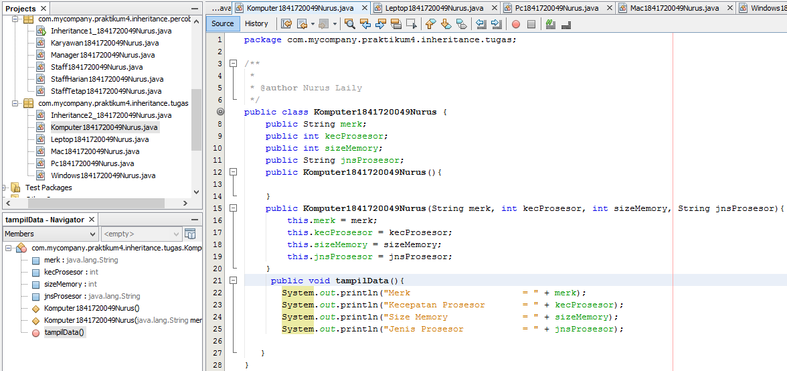
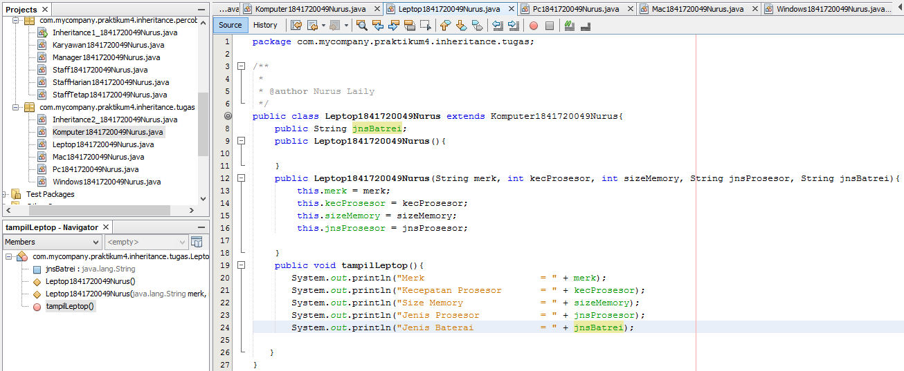
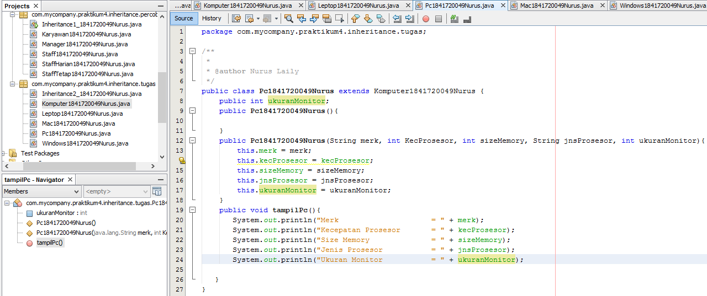
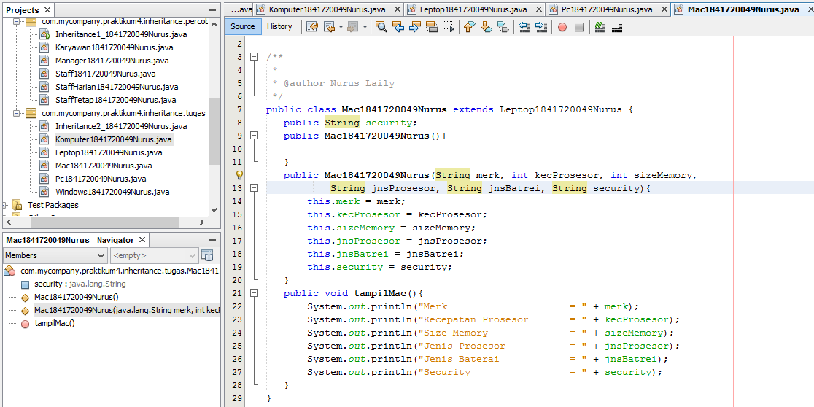
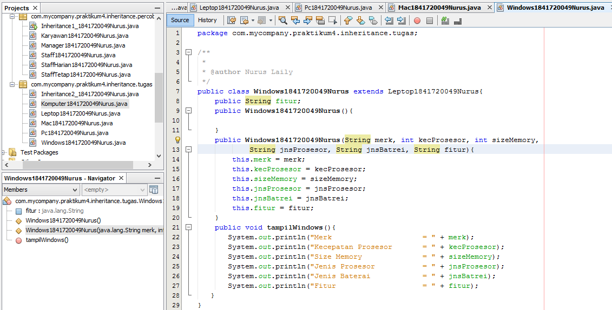
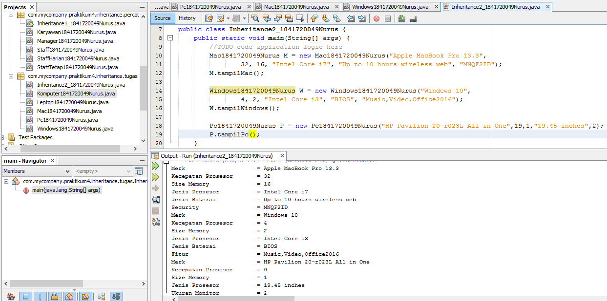

Berikut merupakan contoh source code dari inheritance, yang menggunakan extends
PULLREQ~

link kode program : 

[kode program komputer](../../src/6_Inheritance/Komputer1841720049Nurus.java)

[kode program laptop](../../src/6_Inheritance/Leptop1841720049Nurus.java)

[kode program pc](../../src/6_Inheritance/Pc1841720049Nurus.java)

[kode program mac](../../src/6_Inheritance/Mac1841720049Nurus.java)

[kode program windows](../../src/6_Inheritance/Windows1841720049Nurus.java)

[kode program main](../../src/6_Inheritance/Percobaan4/Inheritance2_1841720049nurus.java)
